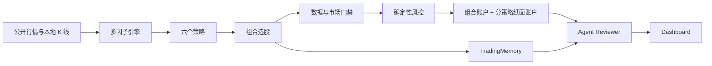

# Trading Agents

[](https://github.com/onmygame2/trading_agents/actions/workflows/ci.yml)
[](https://www.python.org/)
[](LICENSE)

面向 A 股的本地优先量化研究、纸面交易与 Agent 复盘系统。

系统使用本地日 K、多因子评分和六个独立策略生成候选；确定性账户与风控引擎负责纸面执行；Agent Runtime 读取市场、信号、账户和长期记忆，生成每日复盘。项目同时提供 Windows/Linux 自动调度和五页 Dashboard。

> 当前版本只支持纸面交易，不包含真实券商下单适配器。回测与纸面收益不代表未来收益，本项目不构成投资建议。

## 核心特性

- 六策略独立跟踪：每个策略拥有独立 10 万纸面账户。
- 组合账户：根据通过验证的策略权重合并候选。
- 统一交易规则：回测、组合账户和纸面盘共用止损、止盈和持仓规则。
- 数据质量门禁：覆盖率或新鲜度不达标时允许研究，但禁止新增仓位。
- 可信执行状态：明确区分研究推荐、计划买入和实际成交。
- Agent 记忆：SQLite 保存信号、市场状态、策略表现、经验和每日 Brief。
- 本地 Dashboard：工作台、策略中心、记忆中心、历史记录、运维中心。
- 跨平台调度：Windows Task Scheduler 与 Linux Cron 使用同一任务链。
- 一键 Doctor：初始化运行态、生成首日内容并输出可操作的修复建议。

## 快速开始

### 1. 获取代码

```bash
git clone https://github.com/onmygame2/trading_agents.git
cd trading_agents
```

### 2. 安装 Python 3.11 环境

Windows：

```powershell
powershell -ExecutionPolicy Bypass -File scripts/setup_windows.ps1
```

Linux：

```bash
python3.11 -m venv venv_akshare
venv_akshare/bin/pip install --upgrade pip
venv_akshare/bin/pip install -r requirements.txt
```

后续示例中的 `python` 应替换为对应虚拟环境解释器。不要使用存在 NumPy/Pandas ABI 冲突的系统 Python。

### 3. 初始化运行态

```bash
python main.py doctor --fix
python scripts/rebuild_stock_pool.py
python update_kline.py --init-missing --backend akshare
python update_kline.py --snapshot
```

历史数据接口可能限流，首次补库可以使用 `--top` 和 `--offset` 分批执行。日常更新使用全市场批量快照，不需要逐股请求。

### 4. 生成首日真实内容

```bash
python main.py doctor --fix --run-first-day
```

该命令会创建组合账户、六个纸面账户、记忆库、研究推荐和 Agent 日报。非交易时段生成的内容会标记为 `preview_only`，`buy_actions` 保持为空，不会伪造成交。

### 5. 启动 Dashboard

```bash
python dashboard/app.py
```

打开 http://localhost:5890。

更完整的安装说明见 [docs/GETTING_STARTED.md](docs/GETTING_STARTED.md)。

## 工作原理



Agent 不直接下单。任何成交都必须通过结构化计划、数据门禁和确定性风控。

详细设计见 [docs/ARCHITECTURE.md](docs/ARCHITECTURE.md)。

## 策略

当前启用：

- `oversold_reversal`：涨停基因龙回头。
- `breakout_setup`：突破蓄势。
- `mainline_leader`：主线龙头。
- `late_session_surge`：尾盘强收抢筹。
- `sector_leader`：板块龙头跟随。
- `small_cap_volatil`：小盘强势。

策略元数据、权重和过滤条件位于 `strategies_v2/`。统一交易参数位于 `strategies_v2/trade_config.py`。策略改动必须重新运行固定基准回测，并比较 `reports/backtest_v2/summary_benchmark.json`。

## 常用命令

系统检查：

```bash
python main.py status
python main.py doctor
python scripts/health_check.py
python scripts/smoke_check.py
```

研究与纸面交易：

```bash
python main.py pick --top 10
python daily_runner_v2.py
python daily_runner_v2.py --sell-only
python main.py agent review
```

回测：

```bash
python main.py backtest --start 2024-01-01 --end 2025-12-31
python main.py rank
python optimize_weekly.py
```

数据：

```bash
python scripts/rebuild_stock_pool.py
python scripts/audit_stock_pool.py
python update_kline.py --snapshot
python update_kline.py --init-missing --top 200 --offset 0 --backend akshare
```

## 自动运行

Windows：

```powershell
powershell -ExecutionPolicy Bypass -File scripts/install_windows_tasks.ps1
```

Linux：

```bash
bash scripts/install_crontab.sh
```

默认时间：

- 08:30 更新全市场日 K 快照；
- 交易时段每 30 分钟先卖后买；
- 15:15 生成 Agent 日报；
- 周五 20:00 执行策略优化。

调度状态、最近日志和错误可以在 Dashboard 运维中心查看。详见 [docs/OPERATIONS.md](docs/OPERATIONS.md)。

## 目录结构

```text
.
├─ agent_runtime/       Agent 编排、Reviewer、事件存储、交易记忆桥
├─ core/                TradingMemory 与市场状态
├─ dashboard/           Flask API、HTML、CSS 和模块化 JavaScript
├─ strategies_v2/       六个策略、组合配置、统一交易规则
├─ scripts/             安装、调度、健康检查、数据维护、模型工具
├─ docs/                安装、架构、运维、数据与风险文档
├─ config/              可提交的系统配置
├─ data/                股票池元数据；本地行情缓存默认不提交
├─ reports/backtest_v2/ 固定基准摘要
├─ main.py              主 CLI
├─ daily_runner_v2.py   交易时段流水线入口
├─ global_stock_picker.py
├─ trade_engine_v2.py
└─ backtest_v2.py
```

根目录保留少量兼容入口和核心引擎，避免破坏既有 CLI、Cron 和 Windows 调度。运行时生成内容通过 `.gitignore` 与源码隔离。

## 运行态与隐私

以下目录或文件不会进入版本控制：

- `account/`、`state/`、`logs/`；
- `data/kline/`、分钟线、新闻、模型和因子缓存；
- `knowledge_base/*.db`、每日推荐与 Agent 日报；
- `.env` 和 `config/llm_config.json`。

公开仓库前仍应执行 `git status`，确认没有密钥、账户、日志或本地绝对路径。安全报告流程见 [SECURITY.md](SECURITY.md)。

## 数据与风险

公开数据源可能出现限流、停牌缺口、字段变化或服务中断。系统不会把缺失数据当作零值，也不会在数据门禁失败时继续买入。

回测仍可能包含幸存者偏差、成交价格理想化、滑点和容量低估、参数选择偏差等问题。完整边界见 [docs/DATA_AND_RISK.md](docs/DATA_AND_RISK.md)。

## 开发与贡献

```bash
python -m unittest discover -s tests -v
python scripts/smoke_check.py
python -m compileall -q .
```

提交策略改动时，请同时提供测试区间、交易数、收益、最大回撤、Sharpe 以及相对固定基准的变化。贡献规范见 [CONTRIBUTING.md](CONTRIBUTING.md)。

## Roadmap

- Walk-forward 与严格样本外验证。
- 纸面盘策略下线门禁与账户级熔断。
- 更保守的滑点、涨跌停和容量模型。
- 可插拔数据 Provider 与可观测性。
- 在完整审计和影子运行之后，再设计真实券商执行适配层。

## License

[MIT](LICENSE)
