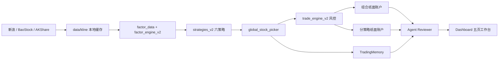

# 系统架构

## 设计原则

Trading Agents 将“研究建议”和“交易执行”分开：

- Agent 负责读取市场、信号、账户和历史经验，生成摘要与建议。
- 因子、策略、风控和账户引擎使用确定性 Python 代码。
- 推荐、计划买入、实际成交分别记录，非交易时段预览不会伪造成交。
- 数据质量门禁先于买入逻辑；数据不完整时允许研究，但禁止新增仓位。

## 数据流

## 代码分区

- `agent_runtime/`：Agent 编排、日报、事件存储和交易记忆桥。
- `core/`：长期交易记忆与市场状态。
- `strategies_v2/`：策略过滤器、组合权重和统一交易参数。
- `dashboard/`：Flask API、模板和静态前端。
- `scripts/`：安装、调度、健康检查、数据维护和模型训练。
- 根目录入口：CLI、日常流水线、回测、选股和交易引擎。保留平铺入口是为了兼容现有 Cron、Windows Task Scheduler 和用户命令。

## 运行态边界

以下内容仅存在于本机，不属于源码：

- `account/`：组合与分策略纸面账户。
- `state/`：任务状态和净值快照。
- `logs/`：调度及服务日志。
- `data/kline/`、`data/minute_kline/`：行情缓存。
- `knowledge_base/*.db`、`knowledge_base/daily_*`：记忆和每日生成内容。

仓库只保留股票池元数据、配置、代码、文档和固定基准摘要。

## 扩展边界

新增策略时，在 `strategies_v2/` 实现策略模块并通过 `manager.py` 加载。新增数据源时，通过 `market_data.py` 暴露统一 DataFrame 契约。真实券商执行器不得直接接收 Agent 自由文本，必须消费经过风控验证的结构化订单计划。

